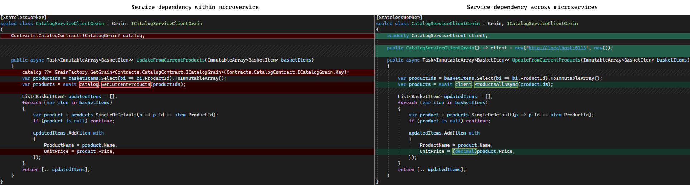

# Orleans.Multiservice
Prevent microservices pain with logical service separation in a modular monolith for [Microsoft Orleans 7](https://learn.microsoft.com/en-us/dotnet/orleans/)

Orleans.Multiservice is an automated code structuring pattern for logical service separation within a Microsoft Orleans (micro)service.

Benefits: allows development teams to avoid significant development overhead / friction common in microservices applications:
- of too many microservices before they are needed (if ever)
- of refactoring when the time has come to move part of the application to a separate microservice

Included in [](https://www.nuget.org/packages/Modern.CSharp.Templates) (see [template usage](#template-usage) to get started)

## Background
It is not uncommon to find single development teams that maintain multiple microservices, ignoring [Conway's Law](https://martinfowler.com/bliki/ConwaysLaw.html) to their detriment. A benefit of microservices is that they can be deployed independently. However, a single team typically has a single deployment rhythm (e.g. in sync with a sprint) and therefore usually deploys their services together.

A lot of development effort can be avoided by structuring the application as a single modular monolith that is designed to be split up with little effort - if and when that actually becomes necessary.
- See [MonolithFirst by Martin Fowler](https://martinfowler.com/bliki/MonolithFirst.html)
- See [this article](https://www.fearofoblivion.com/build-a-modular-monolith-first) for more details on the development overhead of microservices
- See [this Orleans meetup video](https://www.youtube.com/watch?v=dWwxKHclco8) for a real world project where this approach was introduced

Microsoft Orleans allows to build distributed applications using grains, which have grain contracts - C# interfaces. These grains can be considered a kind of 'nano services'. By grouping Grains and their contracts into logical services within an Orleans (micro)service, teams can avoid and postpone the development friction that microservice separation brings until the moment that physical separation is actually needed - e.g. when adding more teams or when dependencies diverge. Even then, the total microservices count can be much lower; many teams will need no more than a single microservice.

Orleans.Multiservice leverages Microsoft Orleans and [Conway's law](https://martinfowler.com/bliki/ConwaysLaw.html) to make life better for developers building distributed (microservices) applications. NJoy!

## What it is
Orleans.Multiservice consists of:
- An example application that demonstrates the pattern in 2 stages of the application's life cycle:

  1) The application starts out as a single microservice, built by a single team, that contains two logical services - one of which depends on the other<br />
     Source: [Single Team/Microservice eShop](https://github.com/Applicita/Orleans.Multiservice/tree/main/src/Example/eShopBySingleTeam/TeamA)
  2) Then a second team is added that will become owner of one of the logical services. A second microservice is added and one logical service is moved into that (in a real world application this could also be moving 5 out of 10 logical services to a second microservice)<br />
     Source: [Two Team/Microservice eShop](https://github.com/Applicita/Orleans.Multiservice/tree/main/src/Example/eShopByTwoTeams)

- A `dotnet new mcs-orleans-multiservice` template to set up a new multiservice, and to add a logical service in an existing multiservice

- A Roslyn code analyzer and/or unit tests to ensure that the pattern is preserved during development. It is used in the template to ensures that the [pattern rules](#pattern-rules) are followed while coding, building and in CI

> The code analyzer / unit tests will be added in a future release. Note that the multiservice pattern can be used without the analyzer by following the code structure of the template and the [pattern rules](#pattern-rules)

## Template usage
1) On the command line, ensure that the [mcs-orleans-multiservice template](https://github.com/Applicita/Modern.CSharp.Templates#readme) is installed<br />(note that below is .NET 7 cli syntax; Orleans 7 requires .NET 7):
    ```
    dotnet new install Modern.CSharp.Templates
    ```
    **Note** that the `dotnet new mcs-orleans-multiservice` template requires **PowerShell** to be installed

2) Type this command to read the documentation for the template parameters:
    ```
    dotnet new mcs-orleans-multiservice -h
    ```

3) To create a new multiservice with one logical service in it, type e.g.:
    ```
    dotnet new mcs-orleans-multiservice --RootNamespace Applicita.eShop --Multiservice TeamA --Logicalservice Catalog --allow-scripts Yes
    ```

4) To add a logical service to an existing multiservice solution, type e.g. this command in PowerShell while in the solution folder:
    ```
    .\AddLogicalService.ps1 Basket
    ```

These two short commands create the solution structure as seen in the single team example below. The solution is ready to run.

## Proof by Example: eShop
The example in this repo illustrates how logical services within a microservice have very low development friction, and how little code needs to be changed when moving logical services to a separate microservice.

This is the code structure before and after the move:


And this is the running API before and after the move:


The example implements two services from an eShop:
- The `CatalogService` contains the current `Product`s in a single `Catalog`
- The `BasketService` contains one `Basket` for each `buyerId`. A `Basket` consists of `BasketItem`s that contain product information (title, price). When a `Basket` is updated, the `BasketService` calls the `CatalogService` to update the product information in the `BasketItem`s.

The only code change needed to move the `CatalogService` to the Team B microservice is in the `CatalogServiceClientGrain`; it is modified to use the generated `CatalogServiceClient` instead of the `ICatalogGrain` Orleans grain contract:



### How to run the example
Single team solution:
- Debug [eShopTeamA.sln](https://github.com/Applicita/Orleans.Multiservice/tree/main/src/Example/eShopBySingleTeam/TeamA)

Two team solution:
- Ensure you have the [.NET OpenAPI tool](https://learn.microsoft.com/en-us/aspnet/core/web-api/microsoft.dotnet-openapi?view=aspnetcore-7.0) installed for .NET 7:
  `dotnet tool install --global Microsoft.dotnet-openapi --version 7.0.0`
  On build, this will generate the `CatalogServiceClient` from `CatalogService.json`
- Debug [eShopTeamAof2.sln](https://github.com/Applicita/Orleans.Multiservice/tree/main/src/Example/eShopByTwoTeams/TeamA) and [eShopTeamBof2.sln](https://github.com/Applicita/Orleans.Multiservice/tree/main/src/Example/eShopByTwoTeams/TeamB)

### How to test the example
When testing the API in the generated swagger UI, you can use any integer for `buyerId`.
A common scenario is:
1) Add some products to the catalog
2) Create a basket for a `buyerId` with some basket items, but use different product titles and prices than you added to the catalog
3) Observe how in the returned basket the product prices and titles have been updated from the catalog

## Pattern rules
These rules ensure that the pattern remains intact:
1) The **only** project references allowed are:<br />
   `Apis     -> Contracts`<br />
   `Apis     -> *Service`<br />
   `*Service -> Contracts`

2) These types are only allowed in specific namespaces:<br />
   All API controllers must be in or under `Apis.<service-name>Api`<br />
   All `public` grain contracts must be in or under `Contracts.<service-name>Contract`<br />

3) References between types in these namespaces are **not** allowed:<br />
   `Apis.<service-name>Api`           -> `Apis.<other-service-name>Api`<br />
   `Apis.<service-name>Api`           -> `Contracts.<other-service-name>Contract`<br />
   `Contracts.<service-name>Contract` -> `Contracts.<other-service-name>Contract`<br />

4) The `public` keyword in `*Service` projects is *only* used on interface member implementations, grain constructors and serializable members in a type.<br />
  This ensures that the only external code access is Orleans instantiating grains. It makes it safe to reference the service implementation projects in the silo host project (Apis) to let Orleans locate the grain implementations; the types in the service implementation projects will not be available in the silo host project.


The Roslyn analyzer will allow rules to be configured in `.editorconfig`


